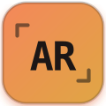

<div align="center">



<h1>André Ricco Terra</h1>

<b>Engenheiro de IA · Desenvolvedor Web Full Stack</b>
<br>
Campo Grande, MS · Brasil · Inglês avançado · Remoto ou híbrido

<br><br>

[](https://portifolioweb-andreterra.netlify.app/)
[](https://www.linkedin.com/in/andr%C3%A9-ricco-1674b8283/)
[](mailto:andre.terra16@gmail.com)

<br>


</div>

<br>

## Sobre

Minha base é engenharia: análise de projetos, planejamento e controle de produção (PCP) em operação industrial de corte e dobra, projetos mecânicos, elétricos e de construção civil, produzindo laudos e relatórios técnicos. Hoje aplico essa mesma lógica analítica ao desenvolvimento web, atuando como Desenvolvedor Web na Salomão Santos Consultoria e Tecnologia.

Construo produto de ponta a ponta: interface em React/Next.js, API em Node.js, dados em PostgreSQL e IA aplicada a problemas reais de operação, sempre modelando o problema antes de escrever a primeira linha de código.

Este repositório é a fonte do meu portfólio pessoal — a página em si (**Oficina Digital**) e a documentação técnica de como ela foi construída.

## Stack

O que uso no dia a dia entregando projetos de clientes (ver **Projetos** abaixo) — não
necessariamente o que roda *este* site: a arquitetura própria da Oficina Digital está
detalhada em **Documentação técnica**, mais adiante.

<p>
  
  
  
  
  
  
  
  
</p>

| Frente | O que cobre |
| --- | --- |
| **Engenharia de IA** | LLMs e APIs, RAG e embeddings, agentes com ferramentas, automação de processos, avaliação de prompt |
| **Desenvolvimento web** | React, Next.js, Node.js, JavaScript/TypeScript, UI de produto |
| **Dados & infraestrutura** | SQL, PostgreSQL, Docker, dashboards |

## Projetos

Cinco projetos reais, entregues para clientes de consultoria e negócios próprios — do zero ao deploy.

<table>
<tr>
<td width="60"><b>01</b></td>
<td>

**[Salomão Select](https://select.salomaosantosconsultec.com.br/)** · projeto principal
Curadoria executiva de talentos internacionais. Funil de 7 fases com portões humanos explícitos, motor de matching por Smart Tags ponderadas e Carta de Indicação bilíngue gerada por IA.
`Next.js 16` `React 19` `TypeScript` `PostgreSQL + Prisma` `OpenAI GPT-4o-mini`
[repositório →](https://github.com/andreterra-lgtm/BANCO-DE-TALENTOS)

</td>
</tr>
<tr>
<td><b>02</b></td>
<td>

**[LP Institucional Salomão Santos](https://salomaosantosconsultec.com.br/)**
Geração de leads e autoridade para consultoria nacional (franchising, valuation, M&A, compliance, tributário). Renderização client e server, formulário via EmailJS, SEO gerenciado.
`React 18` `Vite` `Express (SSR)` `Framer Motion` `EmailJS`
[repositório →](https://github.com/andreterra-lgtm/LP-SALOM-O-SANTOS)

</td>
</tr>
<tr>
<td><b>03</b></td>
<td>

**[Onboarding de Clientes Premium (IA)](https://salomao-onboarding.netlify.app/)**
Wizard estratégico que transforma o briefing de um cliente em PDF consumido diretamente pelo time técnico, com direção visual de luxo discreto.
`React` `Vite` `TypeScript`
[repositório →](https://github.com/andreterra-lgtm/salomao-onboarding)

</td>
</tr>
<tr>
<td><b>04</b></td>
<td>

**[Calculadora de Valuation](https://salomaosantosvaluation.netlify.app/)**
Avaliação empresarial 100% client-side: Berkus + Scorecard, múltiplos de EBITDA e DCF no mesmo produto, sem dado financeiro sensível trafegando pela rede.
`React 19` `TypeScript` `Zustand` `Zod` `Tailwind CSS 4` `Vitest`
[repositório →](https://github.com/andreterra-lgtm/VALUATION)

</td>
</tr>
<tr>
<td><b>05</b></td>
<td>

**[Calculadora de Precificação](https://calculadorasalomaosantos.netlify.app/)**
CMV e preço sugerido para sorveterias e negócios de sobremesa, recalculado ao vivo e pensado para uso em tablet de balcão.
`React 18` `TypeScript` `Vite` `EmailJS` `Netlify Identity`
[repositório →](https://github.com/andreterra-lgtm/Calculadora-Frutos-de-Goi-s)

</td>
</tr>
</table>

Detalhes de problema, resultado, desafios técnicos e estratégia de cada projeto estão no próprio site, na seção **Peças já entregues**.

## Contato

- **E-mail:** [andre.terra16@gmail.com](mailto:andre.terra16@gmail.com)
- **LinkedIn:** [linkedin.com/in/andré-ricco](https://www.linkedin.com/in/andr%C3%A9-ricco-1674b8283/)
- **GitHub:** [@andreterra16-dev](https://github.com/andreterra16-dev)

Tem um projeto de web, dados ou IA em mente? Sempre aberto a conversar.

<br>

---

<details>
<summary><b>Documentação técnica deste repositório</b> — arquitetura, build e como editar (clique para expandir)</summary>

<br>

Portfólio de página única, publicado como um Design Component autocontido
(`Portfolio Andre Ricco.dc.html` + `components/*.js`) — é isso que o navegador
carrega, sem bundler, sem framework do lado do cliente além do runtime vendorizado
(`support.js`).

**Mas isso não é o que se edita.** A fonte de verdade é TypeScript, 100% tipado
sob `strict` mais um conjunto adicional de flags de rigor
(`noUncheckedIndexedAccess`, `exactOptionalPropertyTypes`, `noUnusedLocals`,
`noUnusedParameters`) — zero `any`, zero cast inseguro, zero acesso a índice
sem garantia de existência — em `src/`. Um build (`npm run build`) compila
essa fonte, minificada, de volta para o `.dc.html`/`components/*.js` que o
navegador roda.

O site é bilíngue (PT/EN) e tem dois temas de cor (ver [Idioma e tema](#idioma-e-tema)
abaixo). Todo texto e toda cor de UI vêm de fonte única — `src/data/translations.ts`
e os campos `I18nString` de `SKILLS`/`PRODUCT_TYPES`/`PROJECTS` para o texto,
tokens CSS (`var(--color-…)`) para a cor — nunca hardcoded direto no template;
um util de tipo (`Localized<T>` em `domain.ts`) resolve os campos `I18nString`
de um tipo pro idioma ativo sem precisar de `any` em nenhum ponto de
`renderVals()`.

### Estrutura

```
src/                             FONTE — edite aqui
  types/
    dc-runtime.d.ts               tipos ambient do runtime vendorizado (DCLogic, React global)
    domain.ts                     Project, Skill, ProductType, ComponentState… + o guard do union de Project
  data/
    branch.ts, skills.ts,
    product-types.ts, projects.ts conteúdo do site — cores, texto, stack de cada projeto
                                   (texto em campos I18nString: { pt, en })
    translations.ts               todo texto de UI que não vem dos arquivos acima
                                   (labels de seção, CTAs, chrome do modal, rodapé)
  logic/
    component.ts                  class Component extends DCLogic — estado, handlers, renderVals()
    illustrations.ts              as 3 ilustrações SVG desenhadas à mão (onboarding/valuation/pricing)
    logo-mark.ts                  a logo "AR" do site, como elemento React reutilizável
    favicon.ts                    a mesma marca "AR", como favicon por tema (troca ao vivo com o toggle)
    likes.ts                      persistência do botão de like em localStorage
    whatsapp.ts                   número + gerador de link wa.me com mensagem por tipo de projeto
  components/
    pixel-reveal.ts               <pixel-reveal>  revelação da imagem em tiles
    ascii-cursor.ts               <ascii-cursor>  rastro ASCII que segue o ponteiro
    image-slot.ts                 <image-slot>    placeholder de imagem arrastável

scripts/
  build.ts                        compila src/ → components/*.js + injeta em Portfolio Andre Ricco.dc.html

Portfolio Andre Ricco.dc.html    GERADO — template (editável) + lógica (não editar, vem de src/logic)
index.html                       GERADO — espelho do .dc.html, é o que Netlify/GitHub Pages servem em "/"
components/*.js                  GERADO a partir de src/components/*.ts — não editar
support.js                       runtime do Design Component (vendorizado, não editar)
netlify.toml                     build command + publish dir do deploy no Netlify
assets/                          imagens do site (personagem, retratos, logos parceiras)
uploads/                         originais enviados (fonte dos recortes)
```

### Desenvolvimento

Requer Node 18+.

```bash
npm install         # primeira vez
npm run typecheck    # tsc --noEmit, estrito, sobre src/ e scripts/ — não gera nada
npm run build        # compila src/ → components/*.js + injeta a lógica no .dc.html
npm run verify        # typecheck + build, em sequência — rode isso antes de commitar
```

Depois de rodar `npm run build`, `Portfolio Andre Ricco.dc.html` volta a abrir
direto no navegador (ou via qualquer servidor estático) exatamente como antes —
o build é só o passo que atualiza os arquivos gerados a partir da fonte TS.
Sem build pendente rodado, os arquivos gerados ficam desatualizados em relação
a `src/` — rode `npm run build` sempre que editar algo em `src/` ou `scripts/`.

O build minifica `components/*.js` e o script injetado no `.dc.html` (menos
bytes pro visitante baixar, sem trocar comportamento). Uma exceção
deliberada: o identificador de nível superior `Component` nunca é renomeado —
o runtime da DC (`support.js`) o procura por esse nome exato via
`new Function(...)`, então só a minificação de espaço/sintaxe roda nesse
bundle específico, não a de identificadores.

### Seções do site, na ordem

**Cabeçalho** (fixo, fora da numeração de etapas) — toggles de idioma (PT/EN) e tema
(Warm Forge/Cold Steel), ver [Idioma e tema](#idioma-e-tema).

1. **Hero — etapa 01 · planta.** Título "Oficina Digital", painel emoldurado com a cena da lousa.
2. **Bancada de IA — etapa 02.** Árvore de habilidades clicável; nós e ligações vêm de
   `SKILLS` / `EDGES` na classe de lógica, desenhados num canvas de 800×660 escalado
   (`transform: scale()`) pra preencher o frame em qualquer largura/zoom de desktop. Abaixo de
   720px o canvas dá lugar a `#ia-mobile-groups`: um acordeão por ramo (IA/Web/Dados), lista
   vertical nativa ao toque — sem drag, sem canvas.
3. **O jogo do seu projeto — etapa 03.** Esteira com os 5 tipos de produto que André constrói
   (`PRODUCT_TYPES`) com painel de detalhe e um CTA de WhatsApp com mensagem pré-preenchida.
   Abaixo de 720px a esteira dá lugar a `#esteira-carousel`: um carrossel de cards deslizável
   (`scroll-snap` nativo) com indicador de bolinhas, cada card já autocontido (explicação,
   exemplos, pra quem é, prazo, CTA). Abaixo, os cartões de projeto entregues, cada um com
   modal individual (problema, resultado, desafios técnicos, estratégia de mapeamento e
   evolução).
4. **Sobre — etapa 04 · acabamento.** Texto de posicionamento e números.
5. **Contato — entrega.** E-mail, LinkedIn, rodapé.

### Onde editar o quê

Depois de qualquer mudança em `src/`, rode `npm run build`.

| Quero mudar | Onde |
| --- | --- |
| Tipos de produto (título, explicação, exemplos, pra quem é, prazo) | `src/data/product-types.ts` |
| Texto de UI (labels de seção, CTAs, chrome do modal, rodapé) — PT e EN | `src/data/translations.ts` |
| Cor de tema (Warm Forge e Cold Steel) | tokens `:root` / `html[data-theme="alternate"]` no `<helmet><style>` do `.dc.html` |
| Número/mensagens do WhatsApp | `src/logic/whatsapp.ts` (CTA dinâmico do jogo do projeto); os outros 3 CTAs de WhatsApp são estáticos, direto no `.dc.html` |
| Habilidades da árvore e suas ligações | `src/data/skills.ts` |
| Projetos (título, stack, problema, resultado, desafios, mapeamento, evolução, logo/ilustração, cor) | `src/data/projects.ts` |
| Ilustrações SVG dos projetos sem logo oficial | `src/logic/illustrations.ts` |
| A logo "AR" do site (header, rodapé, selo, modal) | `src/logic/logo-mark.ts` |
| O favicon (ícone da aba, um por tema) | `src/logic/favicon.ts` — e o `<link rel="icon">` estático no `<helmet>`, que é só o que aparece antes do JS montar |
| Estado, handlers de clique, `renderVals()` | `src/logic/component.ts` |
| Imagens dos projetos | arraste sobre os `<image-slot id="proj-1…5">` na própria página — não passa por build, persiste direto no navegador |
| Cor de destaque, cursor, granularidade do reveal | painel de Tweaks (props do componente) |
| Markup/layout/animações CSS | direto em `Portfolio Andre Ricco.dc.html` — só a região dentro de `<script data-dc-script>` é gerada |

### Idioma e tema

Dois toggles no cabeçalho, sempre visíveis, estado persistido em `localStorage`
(`oficina-lang`, `oficina-theme`) e reaplicado no próximo carregamento:

- **Idioma (PT/EN).** `Component.state.lang` seleciona, em `renderVals()`, qual
  metade de cada `I18nString` (dado ou `translations.ts`) vira a `string` que o
  template recebe. Cobertura é 100% do texto visível da página, inclusive as
  mensagens pré-preenchidas dos CTAs de WhatsApp — nada fica hardcoded em um
  idioma só fora de `src/data/`.
- **Tema (Warm Forge/Cold Steel).** `Component.state.theme` vira o atributo
  `data-theme` na tag `<html>`; todo o resto é CSS puro — ver Paleta abaixo.

### Paleta

Toda cor de UI é uma variável CSS (`var(--color-…)`/`var(--rgb-…)` para uso em
`rgba(...)`) declarada em `:root` (tema **Warm Forge**, o padrão) e
redeclarada em `html[data-theme="alternate"]` (tema **Cold Steel**) — nenhuma
cor de interface é hardcoded direto num elemento; as únicas exceções
deliberadas são as que não devem mudar com o tema (o fundo claro atrás dos
logos de projeto, a cor de cada projeto entregue em `PROJECTS` — a identidade
visual do cliente, não da oficina — e sombras neutras).

| Token | Warm Forge (padrão) | Cold Steel (alternativo) |
| --- | --- | --- |
| `--color-bg-base` | `#1B1917` (cimento queimado) | `#111827` (slate escuro) |
| `--color-bg-elevated` / `-alt` / `-panel` | `#26231F` · `#2C2925` · `#221F1C` | `#1F2937` · `#111827` · `#0F172A` |
| `--color-text-main` | `#F1EADD` | `#F3F4F6` |
| `--color-text-sec` / `-muted` / `-soft` / `-body` / `-dim` | `#A69C8C` · `#766D5F` · `#CFC5B4` · `#D6CCBB` · `#5C554A` | `#9CA3AF` · `#6B7280` · `#CBD5E1` · `#D1D5DB` · `#475569` |
| `--color-accent` / `-hover` / `-deep` | `#E4622E` · `#F4885A` · `#C9511F` (laranja) | `#06B6D4` · `#22D3EE` · `#0E7490` (ciano) |
| `--color-support-amber` / `-steel` / `-peach` | `#E0A544` · `#7E8C91` · `#F0C39F` | `#3B82F6` · `#9CA3AF` · `#67E8F9` |

A árvore de habilidades (Bancada de IA) tem seu próprio conjunto —
`--color-branch-ia`/`-web`/`-dados`/`-core` — que segue os mesmos dois temas.

Tipografia: **Archivo** (títulos e corpo) e **JetBrains Mono** (etiquetas, números, metadados),
carregadas do Google Fonts no `<helmet>`.

### Componentes

Fonte em `src/components/*.ts`; `npm run build` gera `components/*.js` a partir dela, não edite
os `.js` diretamente, a próxima build sobrescreve.

**`<pixel-reveal src pixel-size duration replay>`** — desenha a imagem em tiles quadrados que
acendem em ordem aleatória quando entram na viewport. Tiles totalmente transparentes são
descartados na varredura de alfa, então recortes em PNG revelam apenas a silhueta.
`replay="true"` refaz a animação a cada nova entrada.

**`<ascii-cursor cell-size radius density hold box-color text-color fade>`** — overlay fixo em
toda a página. A intensidade é cheia sobre a hero e cai para o fator `fade` conforme a rolagem
avança, para não competir com o conteúdo. Pausa com a aba oculta. Toque tem um perfil de
reação próprio (raio/densidade maiores, quase sem atraso de suavização, sub-passos ao longo do
arrasto) — a intenção é que o dedo pareça "cortar" a página, não só arrastar um cursor de mouse.

No mobile, o gatilho é invertido: assim que o navegador reconhece um arrasto como rolagem, ele
assume o gesto nativamente e para de disparar `pointermove` (às vezes cancela o ponteiro de
vez) — então reagir só a movimento deixaria o efeito quase mudo durante o próprio scroll, que é
a única interação de toque que a página tem. `touchstart`/`touchmove` continuam reportando o
ponto de contato independente disso, e o próprio evento `scroll` (que continua disparando
durante o arraste) re-aciona o efeito nesse ponto a cada tick, só enquanto o dedo está de fato
na tela. Um arrasto rápido demais, ou uma segunda tela de contato simultânea, entra num
cooldown breve (120ms) antes de voltar a reagir — sem isso, o efeito tentava estampar todo o
trajeto num único frame e lia como travamento em vez de rastro.

`box-color`/`text-color` recebem `var(--color-accent)` etc. (ver Paleta), não hex direto — mas o
`fillStyle` de um canvas 2D **não entende custom property de CSS**, só um `<color>` resolvido;
atribuir a string literal `"var(--color-accent)"` a ele falha silenciosamente (fica no preto
padrão, o motivo de o cursor um dia ter "perdido a cor"). O componente resolve isso sozinho:
aplica o valor a um elemento-sonda real no DOM (`probe.style.color = value`) e lê o resultado já
processado via `getComputedStyle`, e reobserva `data-theme` na `<html>` pra re-resolver quando o
tema muda. Se um dia trocar esses atributos por hex direto o probe vira no-op — sem risco, só
desnecessário.

**`<image-slot id placeholder src fit>`** — área de imagem que o usuário preenche arrastando o
arquivo; a escolha persiste entre recarregamentos. Cada slot precisa de um `id` distinto. Aceita
um `src` inicial (usado pelas logos oficiais dos projetos), o usuário ainda pode arrastar por
cima para substituir.

Os três recebem posição e display por regra de elemento no `<helmet><style>`, não defina esses
valores por JavaScript, o runtime reescreve o atributo `style` a cada render.

### Regras de estilo do arquivo

- Estilos são **inline**, por elemento. O `<style>` do `<helmet>` guarda apenas o que não pode
  ser inline: reset do body, `@keyframes`, as regras de elemento dos componentes e os tokens
  de cor (`:root` / `html[data-theme="alternate"]` — ver Paleta acima).
- Sem folhas de estilo externas, sem classes utilitárias. Cor é sempre `var(--token)`, nunca
  hex direto (fora das exceções deliberadas descritas em Paleta).
- Toda lógica (estado, handlers, dados) fica na classe `Component`; o template só consome
  valores já prontos por nome. A fonte dessa lógica é `src/logic/component.ts`, o bloco
  `<script data-dc-script>` no `.dc.html` é gerado a partir dela, não editado à mão.

</details>

<br>

<p align="center"><sub>© 2026 André Ricco Terra · Oficina Digital</sub></p>
